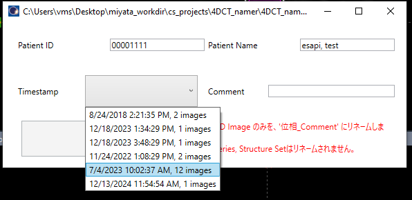

# 4D_CT_namer

ESAPI Binary Plugin to ease 4DCT images renaming.

This script renames each 3D image with the phase prefix to an arbitrary string.

Created with ESAPI v15.5.

This is in the process of i8n.

## How to use

1. Start the script and select the image set you would like to rename. Since image sets are grouped by creation date time (expected to be the same for each phase image created from a single 4DCT), you can determine the image set to be renamed by looking at the timestamp and number of images.

   

2. Enter the desired text string in the “Comment” text box following the phase number and click on the '位相_\*\*\*にリネームする。' button. 

   

3. The 3D Image for each phase is renamed.

   

## LICENSE

Released under the MIT license.

No responsibility is assumed for anything that occurs with this software.

See [LICENSE](https://github.com/akiaji-k/plan_checker_gui_esapi_v15_5/blob/main/LICENSE) for further details.