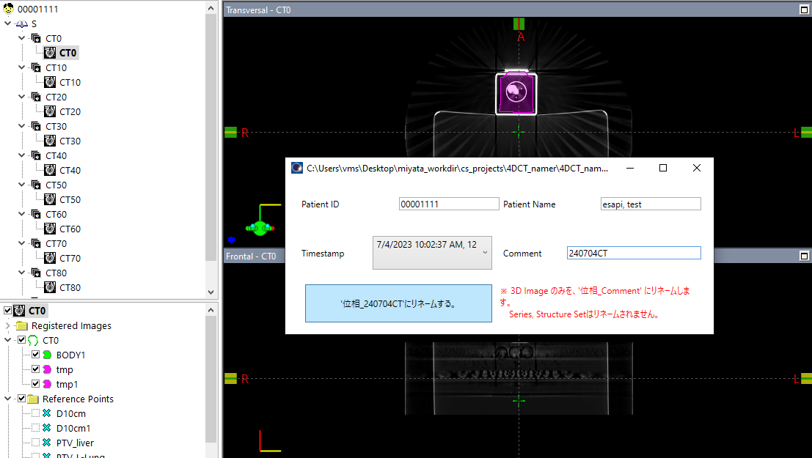
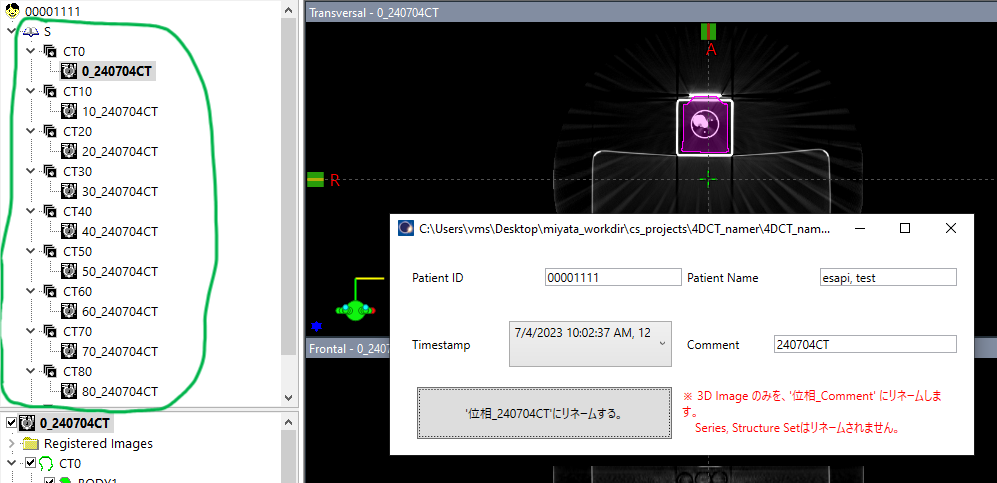

# 4D_CT_namer

4DCT画像のリネームを楽にするためのESAPI Binary Pluginです。

このスクリプトは、各位相の3D imageの名前を、"位相_(任意の文字列)"に変更します。

ESAPI v15.5で作成されています。

本ソフトウェアの多言語への翻訳は途中です。

## 使用方法

1. スクリプトを起動し、リネームしたい画像セットを選択します。画像セットはCreation date time(一つの4DCTから作成された各位相画像で同じになると期待される)でグループ化されるため、タイムスタンプと画像数を見ることでリネーム対象の画像セットが決定できます。

   

2. 位相の数字の後につけたい任意の文字列を"Comment"テキストボックスに入力し、 '位相_\*\*\*にリネームする。' ボタンをクリックします。

   

3. 各位相の3D Imageの名前が変更されます。

   

## ライセンス

MIT ライセンスで公開されています。

本ソフトウェアで発生したことについて、いかなる責任も負いません。

詳細は [LICENSE](https://github.com/akiaji-k/4DCT_namer/blob/main/LICENSE) をご確認ください。

